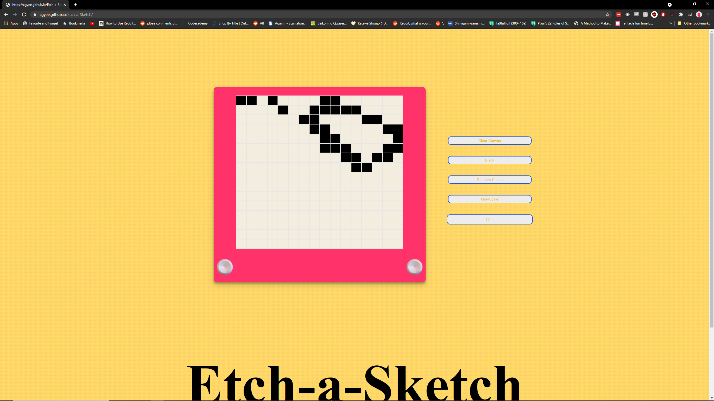

#Etech a Sketch!
The purpose of this project was to test my DOM manipulation abilities and implementation
**Link to project:** https://cgyee.github.io/Etch-a-Sketch/

## How It's Made:

**Tech used:** HTML, CSS, JavaScript

The the surface that the user can draw on is static however the 'pixel' density that the user can draw on is variable from a minimum 16(16x16 grid) to a maximum of 99(99x99 grid). Each of these pixels scale to their relative size so the size of draw surface never changes. When a person moves a mouse over a pixel the corresponding element has a event listener that updates that elements colour to 'draw' on the surface. Each color selection button merely changes which CSS class is used when a person hovers over an element.

## Optimizations

Some optimizations I would take would be redesign how the grid is implemented. Largers grids start to make the user experience slow, and to update the grid size the user has to select/enter the grid size they want click outside the input box then click inside it again. Not very intuitive I'll admit. Storing the grid in local memory would also be a nice feature so a user can return to their doodle at a later time.

## Other stuff I've worked on:
Take a look at some of my other projects:

**Tic-Tac-Toe:** https://github.com/cgyee/Tic-Tac-Toe

**Memory Card Game:** https://github.com/cgyee/memory-card
